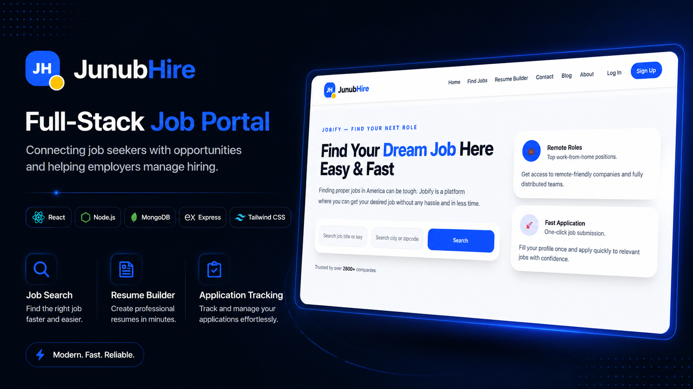

# JunubHire

JunubHire is a full-stack job portal web application built to connect job seekers with employment opportunities and help employers manage job postings and applications efficiently.

The platform supports authentication, role-based access, job browsing, job posting, application tracking, resume support, profile management, password reset, and admin job management.

## Table of Contents

- [Overview](#overview)
- [Features](#features)
- [Tech Stack](#tech-stack)
- [Project Structure](#project-structure)
- [Getting Started](#getting-started)
- [Environment Variables](#environment-variables)
- [Available Scripts](#available-scripts)
- [API Overview](#api-overview)
- [User Roles](#user-roles)
- [Security Practices](#security-practices)
- [Deployment Notes](#deployment-notes)
- [Project Preview](#project-preview)
- [Future Improvements](#future-improvements)
- [Author](#author)

## Overview

JunubHire is designed for two main groups of users:

1. Job seekers who can register, log in, browse jobs, apply for jobs, manage their profile, build or attach resumes, and track their job application status.
2. Admins or employers who can post jobs, manage their own job listings, view applicants, and update application statuses.

The application is built with a React frontend and an Express backend connected to MongoDB.

## Features

### General Features

- Responsive landing page
- Clean navigation experience
- Job search and filtering
- Job details modal
- Contact and blog navigation support
- Reusable feedback message system
- Auto-clearing success and error messages

### Authentication Features

- User registration
- User login
- JWT-based authentication
- Protected routes
- Role-based route protection
- Profile management
- Username update
- Password change
- Forgot password and reset password flow
- Password reset email support using Nodemailer

### Job Seeker Features

- Browse available jobs
- View detailed job information
- Apply for jobs
- Submit application details
- Use saved resume details
- View submitted applications
- Track application status
- Withdraw applications

### Admin Features

- Admin-only job posting
- View jobs posted by the current admin
- Update own job listings
- Delete own job listings
- View applications submitted to own jobs
- Update application status

### Application Status Workflow

Applications can be tracked using statuses such as:

- Pending
- Reviewed
- Accepted
- Rejected

This helps job seekers follow the progress of their applications and allows admins to manage applicants more effectively.

## Tech Stack

### Frontend

- React
- Vite
- Tailwind CSS
- React Router
- Axios
- React Icons

### Backend

- Node.js
- Express.js
- MongoDB
- Mongoose
- JSON Web Token
- bcrypt
- Nodemailer
- CORS
- dotenv

## Project Structure

```txt
careerhub/
├── backend/
│   ├── src/
│   │   ├── controllers/
│   │   ├── middleware/
│   │   ├── models/
│   │   ├── routes/
│   │   ├── utils/
│   │   ├── app.js
│   │   └── server.js
│   ├── package.json
│   └── .env
│
├── frontend/
│   ├── src/
│   │   ├── components/
│   │   ├── data/
│   │   ├── hooks/
│   │   ├── pages/
│   │   ├── routes/
│   │   ├── services/
│   │   ├── App.jsx
│   │   └── main.jsx
│   ├── package.json
│   └── .env
│
└── README.md
```

## Getting Started

Follow these steps to run JunubHire locally.

### 1. Clone the Repository

```bash
git clone https://github.com/NELSONHENRY23/careerhub.git
cd careerhub
```

### 2. Install Backend Dependencies

```bash
cd backend
npm install
```

### 3. Install Frontend Dependencies

```bash
cd ../frontend
npm install
```

### 4. Configure Environment Variables

Create a `.env` file inside the `backend` folder and another `.env` file inside the `frontend` folder.

### 5. Start the Backend Server

```bash
cd backend
npm run dev
```

By default, the backend runs on:

```txt
http://localhost:5000
```

### 6. Start the Frontend Development Server

```bash
cd frontend
npm run dev
```

The frontend will run on the Vite development URL shown in your terminal.

## Environment Variables

### Backend `.env`

Create this file inside:

```txt
backend/.env
```

Example:

```env
PORT=5000
MONGO_URI=your_mongodb_connection_string
JWT_SECRET=your_jwt_secret_key
FRONTEND_URL=http://localhost:5137
EMAIL_USER=your_email@gmail.com
EMAIL_PASS=your_google_app_password
```

`EMAIL_USER` is the sender email used by JunubHire to send password reset emails.

`EMAIL_PASS` should be a Google App Password, not your normal Gmail password.

### Frontend `.env`

Create this file inside:

```txt
frontend/.env
```

Example:

```env
VITE_API_URL=http://localhost:5000
VITE_DISABLE_AUTH=false
```

Do not store private backend secrets in the frontend `.env` file because frontend environment variables can be exposed in the browser.

## Available Scripts

### Backend

```bash
npm run dev
```

Runs the backend server using nodemon.

```bash
npm start
```

Runs the backend server using Node.

### Frontend

```bash
npm run dev
```

Starts the Vite development server.

```bash
npm run build
```

Builds the frontend for production.

```bash
npm run preview
```

Previews the production build locally.

```bash
npm run lint
```

Runs ESLint checks.

## API Overview

### Authentication Routes

Base path:

```txt
/api/auth
```

Common routes include:

```txt
POST /register
POST /login
GET  /me
PUT  /profile
PUT  /change-password
POST /forgot-password
PUT  /reset-password/:token
```

### Job Routes

Base path:

```txt
/api/jobs
```

Common routes include:

```txt
GET    /
GET    /my-jobs
GET    /:id
POST   /
PUT    /:id
DELETE /:id
```

Admin job routes are protected using authentication and role-based middleware.

### Application Routes

Base path:

```txt
/api/applications
```

Common routes include:

```txt
POST   /
GET    /my-applications
GET    /:applicationId
DELETE /:applicationId
GET    /job/:jobId
PUT    /:applicationId/status
```

## User Roles

### Job Seeker

A normal user can:

- Register and log in
- Browse jobs
- View job details
- Apply for jobs
- View submitted applications
- Track application status
- Withdraw applications
- Manage profile details
- Change password
- Reset forgotten password through email

### Admin

An admin can:

- Post jobs
- View jobs they posted
- Update their own jobs
- Delete their own jobs
- View applications submitted to their jobs
- Update application statuses

## Security Practices

JunubHire applies several security-focused practices:

- Passwords are hashed before storage.
- Authentication uses JSON Web Tokens.
- Protected routes require a valid token.
- Admin routes require both authentication and admin role authorization.
- Users can only manage their own applications.
- Admins can only update or delete jobs they posted.
- Password reset tokens expire and are cleared after use.
- Sensitive environment variables are stored outside source code.
- Frontend API requests attach authorization tokens through a shared Axios service.
- Email credentials are stored only in the backend environment file.

## UI and UX Practices

The frontend uses Tailwind CSS for consistent styling across pages and components.

Reusable UI improvements include:

- Shared API service
- Protected route components
- Admin route protection
- Reusable feedback hook
- Reusable feedback alert component
- Clean modal-based workflows
- Consistent success and error messages
- Auto-clearing feedback messages
- Responsive layouts for desktop and mobile screens

## Deployment Notes

JunubHire can be deployed using separate hosting services for the frontend and backend.

### Frontend Deployment

The frontend can be deployed to:

- Vercel
- Netlify
- Render Static Site

Production frontend environment variable:

```env
VITE_API_URL=https://your-backend-url.com
```

### Backend Deployment

The backend can be deployed to:

- Render
- Railway
- Fly.io

Production backend environment variables:

```env
PORT=5000
MONGO_URI=your_production_mongodb_uri
JWT_SECRET=your_production_jwt_secret
FRONTEND_URL=https://your-frontend-url.com
EMAIL_USER=your_email@gmail.com
EMAIL_PASS=your_google_app_password
```

### Database

MongoDB Atlas is recommended for production database hosting.

Before deployment, confirm that:

- The backend starts correctly using `npm start`
- The frontend builds successfully using `npm run build`
- CORS allows the deployed frontend URL
- Environment variables are configured correctly
- No `.env` files are committed to GitHub

## Project Preview

A project thumbnail or screenshot will be added after deployment.

Recommended preview image:

```txt
docs/thumbnail.png
```

After deployment, take a clean screenshot of the homepage or dashboard and add it to this section:

```md

```

## Future Improvements

Possible future enhancements include:

- Resume file upload
- Email notifications for application status updates
- Admin analytics dashboard
- Saved jobs feature
- Job recommendations
- Pagination for jobs and applications
- Advanced search optimization
- Unit and integration testing
- CI/CD deployment pipeline

## Author

Built by Nelson Henry.

## License

This project is currently for educational and portfolio purposes.
